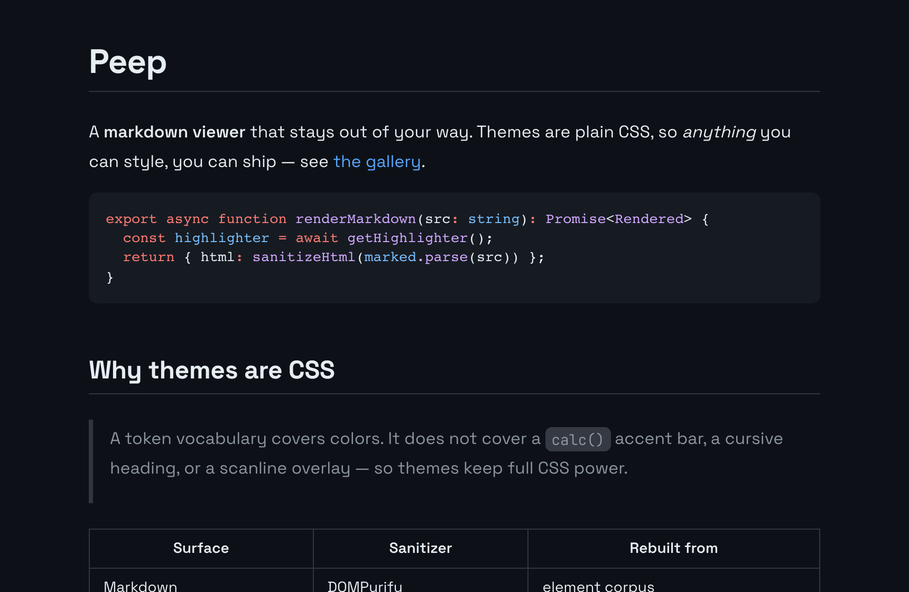
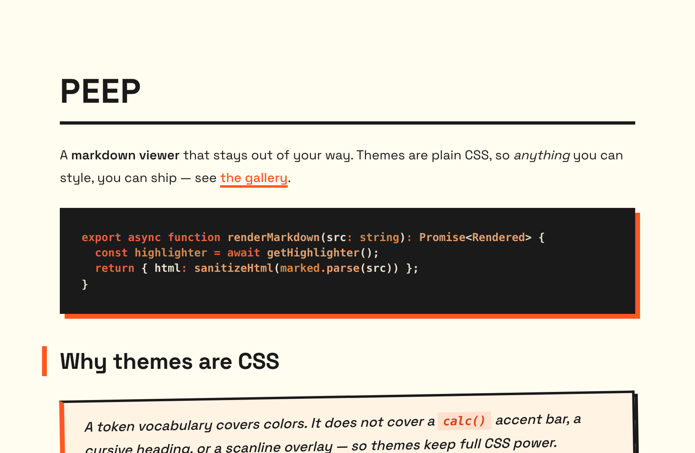

<div align="center">

<picture>
  <source media="(prefers-color-scheme: dark)" srcset="docs/hero/banner-dark.svg">
  
</picture>

A fast, themeable desktop markdown viewer. Point it at a file and read.

</div>

| | |
| :---: | :---: |
|  |  |
| **GitHub Dark** | **Neo Brutalist** |

The same document, two of the seven built-in themes. Themes are plain CSS, so they change layout and type as freely as color, not just recolor it — [twenty more](#themes) come built in or as importable files.

```bash
peep README.md
```

peep is a reader, not an editor. It opens markdown from the command line, renders it with syntax highlighting, math, and diagrams, and reloads the moment the file changes on disk — so it sits well beside whatever editor you already use. Built with Tauri 2 and Svelte 5.

## Install

Download the latest build from the [releases page](https://github.com/thomastheyoung/peep/releases/latest):

| Platform | File |
| --- | --- |
| macOS (Apple Silicon) | `peep_*_aarch64.dmg` |
| Linux | `peep_*_amd64.AppImage` — `chmod +x` before running |
| Windows | `peep_*-setup.exe` |

macOS builds are Apple Silicon only; there is no Intel build.

peep updates itself. It checks quietly on launch, shows a badge in the title bar when a new version is ready, and installs on demand from the command palette (Cmd+K → "Check for updates") or the peep menu.

### macOS first launch

peep is not yet notarized by Apple, so the first launch is blocked with a message claiming the app is **"damaged and can't be opened."** It is not damaged — that message means the app is unsigned. Clear the quarantine flag once, after moving peep to Applications:

```bash
xattr -cr /Applications/peep.app
```

This applies only to the initial download. Later self-updates launch normally, because the updater never sets the quarantine flag.

## Usage

```bash
# Open a file
peep README.md

# Open several — each becomes a tab
peep file1.md file2.md

# Open every .md and .markdown file in a directory
peep docs/
```

Files live-reload when they change on disk. If peep is already running, a second launch hands its files to the open window and focuses it rather than starting a second app.

## What it renders

Markdown goes through [marked](https://marked.js.org/), then the result is sanitized with DOMPurify before it reaches the DOM.

- **Syntax highlighting** — 18 languages via [Shiki](https://shiki.style/), themed through CSS variables so code colors follow the active theme instead of being frozen at build time
- **Math** — LaTeX via KaTeX, inline and block
- **Diagrams** — Mermaid, re-rendered when the theme changes
- **Footnotes** and **`:emoji:` shortcodes**
- **Copy buttons** on every code block
- **Table of contents** — a floating dock that tracks the heading you are reading

## Themes

Seven themes ship in the app — GitHub Dark, GitHub Light, Neo Brutalist, Pastel Dream, Swiss Design, Candy Pop, and Minimal Mono — each previewed live in the command palette before you commit to it.

Fifteen more live in [`themes/`](./themes) as a browsable gallery, [previewed in full](./themes#previews). They are plain CSS files rather than bundled themes: open the palette, choose **Import theme…**, and pick one. Imported themes are watched on disk, so editing the file updates the app as you type — which makes the gallery files a reasonable starting point for writing your own. Copy one, edit its `/*! @name … */` frontmatter and its `.app` rule, and re-import.

Imported CSS is untrusted input, and peep treats it that way. Rather than pattern-matching the source text, the sanitizer parses the CSS into a constructed stylesheet and **rebuilds the output from the parsed rule tree**, so an attack that only exists in the source string cannot survive into the output. On top of that it strips `!important`, drops `@property`, namespaces `@keyframes`, and scopes everything to the content area so a theme cannot repaint the app's own chrome. The reasoning, including the string-based design this replaced and how it was defeated, is documented at the top of [`sanitize-theme-css.ts`](./src/lib/themes/sanitize-theme-css.ts).

## Keyboard shortcuts

| Shortcut | Action |
| --- | --- |
| Cmd+K | Command palette |
| Cmd+O | Open file dialog |
| Cmd+W | Close current tab |
| Cmd+, | Toggle preferences |
| Cmd+] / Cmd+Right | Next tab |
| Cmd+[ / Cmd+Left | Previous tab |
| Cmd+= / Cmd+- / Cmd+0 | Zoom in / out / reset |

Cmd+K reaches everything: themes, typography, content width, opening and closing files, updates. The preferences panel (Cmd+,) is the same settings rendered as a panel — both read one registry in `preferences.svelte.ts`, so they cannot drift apart.

Also here: tabs close on middle-click, content width switches between reading-optimized, wide, and full, font weight / letter spacing / line height are adjustable, and window position and size persist across sessions.

## Development

```bash
pnpm install

pnpm tauri dev        # full app — compiles Rust, launches the webview
pnpm dev              # frontend only, port 1420
pnpm tauri build      # production build

pnpm check            # svelte-check
pnpm test             # vitest
pnpm storybook        # component, theme, and design-exploration stories
```

Some files here are generated, and editing them by hand gets your work overwritten:

```bash
pnpm gen:theme-colors    # theme preview swatches, read out of each theme's own CSS
pnpm gen:gallery-readme  # themes/README.md
pnpm gen:theme-shots     # docs/theme-shots/*.png — every theme, rendered

# the two cropped shots at the top of this file
pnpm gen:theme-shots --only github-dark,neo-brutalist --crop --height 560 --out docs/hero
```

Theme swatches are derived rather than authored so a preview color cannot disagree with what the theme actually paints. The screenshots run the app's real `renderMarkdown` inside headless Chromium, so syntax highlighting, math, and font loading are the ones the app ships rather than a fixture's approximation of them. Re-run it after changing a theme's CSS — nothing yet fails when a committed PNG goes stale.

Two test suites deliberately run outside vitest, because jsdom cannot answer the questions they ask — it models neither `@layer` nor `var()`, so cascade assertions there pass or fail for the wrong reason:

```bash
pnpm test:sanitizer   # adversarial theme CSS, in real Chromium and WebKit
pnpm diff:themes      # computed-style diff per theme against HEAD
```

`CLAUDE.md` carries the fuller architecture notes.

## Releasing

`package.json` is the single source of truth for the version — `tauri.conf.json` inherits it, and that is what the updater compares against the release manifest. CI fails the build if the tag and `package.json` disagree.

```bash
pnpm release          # bumps the minor version, tags, and pushes
```

The tag push builds macOS, Linux, and Windows and opens a **draft** release. Review the artifacts, then publish it — `latest.json` only becomes reachable at `/releases/latest/download/` once the release is no longer a draft.

Updates are signed with a [minisign](https://jedisct1.github.io/minisign/) keypair generated by `pnpm tauri signer generate -- -w ~/.tauri/peep.key`. The public half lives in `tauri.conf.json`; the private half and its password are the `TAURI_SIGNING_PRIVATE_KEY` and `TAURI_SIGNING_PRIVATE_KEY_PASSWORD` repository secrets.

> **Back up the private key somewhere outside GitHub.** The public key is compiled into every shipped binary, so losing the private key permanently orphans every installed copy — a replacement key produces signatures existing clients reject, and you cannot ship a fix, because that update would itself need the lost key to sign it. The only remedy is asking every user to reinstall by hand.

## How it fits together

Two processes. Rust owns the filesystem; the webview owns rendering.

- **Rust** ([`src-tauri/src/lib.rs`](./src-tauri/src/lib.rs)) — reads files, watches them with [`notify`](https://docs.rs/notify), owns the native menus and window state, scans the user-theme directory, and routes a second launch's arguments into the running window
- **SvelteKit** — static adapter, SSR off, Svelte 5 runes for state. State lives in module-level singletons (`tabs`, `preferences`, `themeState`, `commandPalette`, `updater`) rather than being threaded through props

## License

MIT
