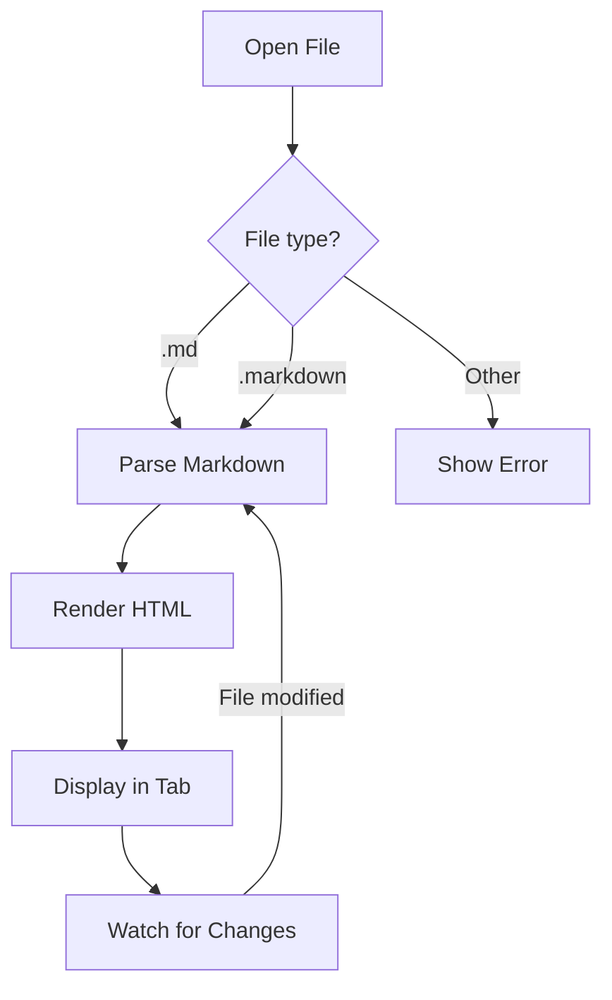
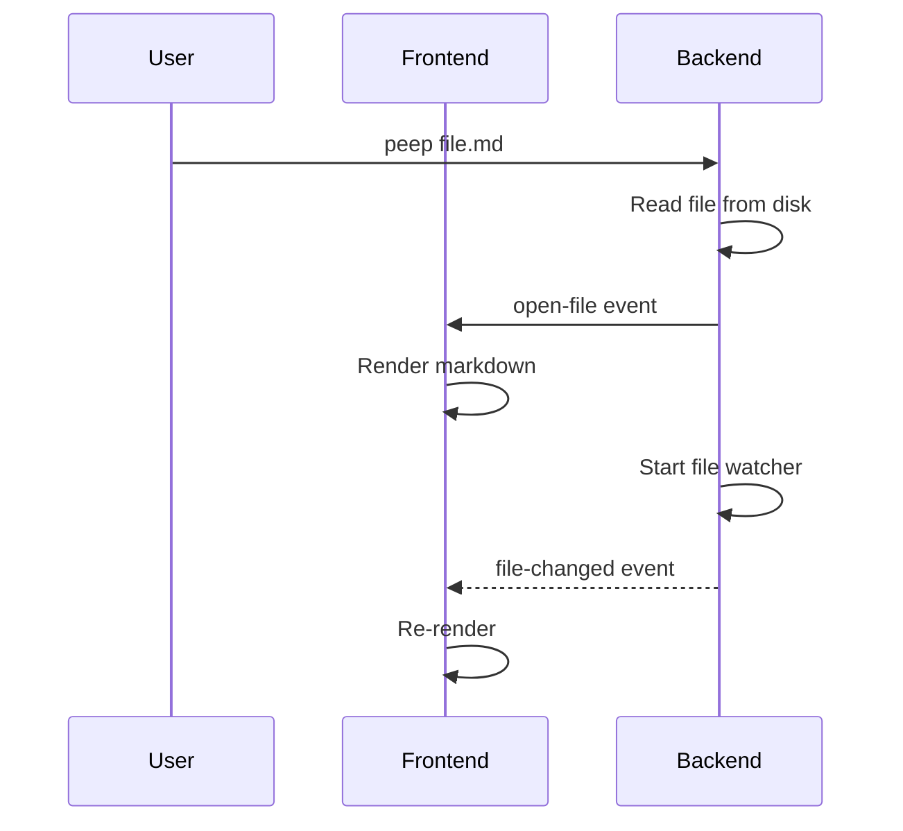
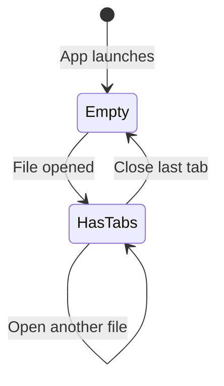

# Welcome to peep

A beautiful, fast markdown viewer built with **Tauri** + **Svelte 5**.

## Features

- Live file watching with instant re-render
- Syntax-highlighted code blocks
- Dark and light themes
- Tabbed interface for multiple files

## Heading levels

### Third-level heading

#### Fourth-level heading

##### Fifth-level heading

###### Sixth-level heading

### [Heading with a link](https://example.com)

## Inline formatting

This is **bold**, this is _italic_, this is **_bold and italic_**.

This is ~~strikethrough~~ text.

This is `inline code` within a sentence.

This uses <kbd>Cmd</kbd>+<kbd>K</kbd> for keyboard shortcuts.

This has <mark>highlighted text</mark> using the mark element.

This has <sub>subscript</sub> and <sup>superscript</sup> text.

Escaped special characters: \*not bold\*, \`not code\`, \# not a heading.

Line break with two trailing spaces:
This is on a new line but same paragraph.

Line break with br tag:<br>This is also on a new line.

## Links

Inline link: [Example](https://example.com)

Inline link with title: [Example](https://example.com "Example Website")

Autolink: <https://example.com>

Reference-style link: [Marked documentation][marked]

[marked]: https://marked.js.org "Marked.js"

## Images


Image inside a link:

[](https://example.com)

## Lists

### Unordered list

- First item
- Second item
- Third item with **bold** and `code`

### Ordered list

1. First step
2. Second step
3. Third step

### Nested lists (mixed)

1. Backend setup
   - Install Rust toolchain
   - Configure Tauri
     1. Add plugins
     2. Set permissions
     3. Configure window
   - Build and test
2. Frontend setup
   - Install dependencies
     - `pnpm install`
     - Check for peer warnings
   - Configure Vite
3. Integration
   - Connect events
   - Test IPC

### Deeply nested list

- Level 1
  - Level 2
    - Level 3
      - Level 4
        - Level 5
          - Level 6

### Task list

- [x] Markdown rendering
- [x] Syntax highlighting
- [x] File watching
- [x] Theme system
- [ ] LaTeX support
- [ ] Mermaid diagrams
- [ ] Export to PDF

## Blockquotes

> "The best way to predict the future is to invent it."
> — Alan Kay

### Nested blockquotes

> This is the outer quote.
>
> > This is a nested quote inside the outer one.
> >
> > > And this goes three levels deep.
>
> Back to the outer level.

### Blockquote with other elements

> #### Blockquote heading
>
> - Item one
> - Item two
>
> Some text with `code` and **bold**.
>
> ```
> code block inside a blockquote
> ```

## Tables

### Basic table

| Feature             | Status |
| ------------------- | ------ |
| Markdown rendering  | Done   |
| Syntax highlighting | Done   |
| File watching       | Done   |
| Themes              | Done   |

### Table with alignment

| Left-aligned        | Center-aligned | Right-aligned |
| :------------------ | :------------: | ------------: |
| Left                |     Center     |         Right |
| `code`              |    **bold**    |      _italic_ |
| Longer content here |     Short      |      1,234.56 |

### Wide table (horizontal scroll)

| Column 1       | Column 2 | Column 3  | Column 4    | Column 5   | Column 6    | Column 7     | Column 8 |
| -------------- | -------- | --------- | ----------- | ---------- | ----------- | ------------ | -------- |
| Data           | Data     | Data      | Data        | Data       | Data        | Data         | Data     |
| More data here | And more | Even more | Still going | Keep going | Almost done | Nearly there | Finally  |

## Code blocks

### TypeScript

```typescript
async function renderMarkdown(source: string, theme: "dark" | "light") {
  const highlighter = await createHighlighter({
    themes: ["github-dark", "github-light"],
    langs: ["typescript", "rust", "python"],
  });
  return marked.parse(source);
}
```

### Rust

```rust
fn main() {
    println!("Hello from Rust!");
    let numbers: Vec<i32> = (1..=10).filter(|n| n % 2 == 0).collect();
    dbg!(numbers);
}
```

### Python

```python
def fibonacci(n: int) -> list[int]:
    """Generate the first n Fibonacci numbers."""
    if n <= 0:
        return []
    fib = [0, 1]
    while len(fib) < n:
        fib.append(fib[-1] + fib[-2])
    return fib[:n]

print(fibonacci(10))
```

### Bash

```bash
#!/bin/bash
for file in *.md; do
    echo "Processing: $file"
    wc -w "$file"
done | sort -t: -k2 -n -r
```

### JSON

```json
{
  "name": "markdown-viewer",
  "version": "0.1.0",
  "dependencies": {
    "marked": "^15.0.0",
    "shiki": "^3.0.0"
  },
  "scripts": {
    "dev": "vite dev",
    "build": "vite build"
  }
}
```

### CSS

```css
.markdown-body {
  --font-size: 16px;
  --line-height: 1.6;
  --max-width: 48rem;

  font-size: var(--font-size);
  line-height: var(--line-height);
  max-width: var(--max-width);
  margin: 0 auto;
}
```

### HTML

```html
<!DOCTYPE html>
<html lang="en">
  <head>
    <meta charset="UTF-8" />
    <title>Markdown Viewer</title>
  </head>
  <body>
    <div id="app"></div>
    <script type="module" src="/src/main.ts"></script>
  </body>
</html>
```

### Diff

```diff
- const oldFunction = () => { return null; };
+ const newFunction = (input: string): Result => {
+   return process(input);
+ };
```

### Shell output (no highlighting)

```
$ peep README.md
Opening file: README.md
Watching for changes...
[2024-01-15 10:23:45] File changed, re-rendering...
```

### Plain fenced block (no language)

```
This is a fenced code block
with no language specified.
It should render as plain monospace text.
```

### Indented code block

    This is an indented code block.
    It uses 4 spaces of indentation.
    No language highlighting here.

### Long lines (horizontal scroll test)

```typescript
const veryLongConfigurationObject = {
  theme: "dark",
  language: "typescript",
  enableSyntaxHighlighting: true,
  enableLineNumbers: true,
  enableWordWrap: false,
  fontFamily: "JetBrains Mono, Fira Code, monospace",
  fontSize: 14,
  tabSize: 2,
  insertSpaces: true,
  renderWhitespace: "boundary",
  minimap: { enabled: false },
  scrollBeyondLastLine: false,
};
```

## Math formulas

Inline math: The quadratic formula is $x = \frac{-b \pm \sqrt{b^2 - 4ac}}{2a}$.

Display math:

$$
\int_{-\infty}^{\infty} e^{-x^2} \, dx = \sqrt{\pi}
$$

Euler's identity:

$$
e^{i\pi} + 1 = 0
$$

A summation:

$$
\sum_{n=1}^{\infty} \frac{1}{n^2} = \frac{\pi^2}{6}
$$

Maxwell's equations (differential form):

$$
\nabla \cdot \mathbf{E} = \frac{\rho}{\varepsilon_0}, \quad \nabla \times \mathbf{B} = \mu_0 \mathbf{J} + \mu_0 \varepsilon_0 \frac{\partial \mathbf{E}}{\partial t}
$$

## Mermaid diagrams

### Flowchart



### Sequence diagram



### State diagram



## Footnotes

This statement needs a citation[^1]. And here's another claim[^2].

[^1]: This is the first footnote with a detailed explanation.

[^2]: This is the second footnote. It can contain **formatting** and `code`.

## Definition lists

<dl>
  <dt>Markdown</dt>
  <dd>A lightweight markup language for creating formatted text using a plain-text editor.</dd>
  <dt>Tauri</dt>
  <dd>A framework for building tiny, fast binaries for all major desktop platforms.</dd>
  <dt>Svelte</dt>
  <dd>A component framework that compiles at build time, producing minimal JavaScript.</dd>
</dl>

## Collapsible sections

<details>
<summary>Click to expand: implementation details</summary>

This content is hidden by default. It can contain any markdown:

- Lists
- **Bold text**
- `Code`

```typescript
const hidden = "This code is inside a collapsible section";
```

</details>

<details>
<summary>Another collapsible section</summary>

| Column A | Column B |
| -------- | -------- |
| Data 1   | Data 2   |

</details>

## Raw HTML blocks

<div style="padding: 1em; border: 2px dashed currentColor; border-radius: 8px; opacity: 0.8;">
  <strong>This is a raw HTML block</strong> with inline styles.
  <br>
  It tests how the viewer handles arbitrary HTML.
</div>

<figure>
  <blockquote>
    <p>Any sufficiently advanced technology is indistinguishable from magic.</p>
  </blockquote>
  <figcaption>— Arthur C. Clarke</figcaption>
</figure>

## Emoji shortcodes

If supported: :rocket: :sparkles: :bug: :white_check_mark: :warning:

Unicode emoji fallback: 🚀 ✨ 🐛 ✅ ⚠️

## Long paragraph (word wrap stress test)

Lorem ipsum dolor sit amet, consectetur adipiscing elit. Sed do eiusmod tempor incididunt ut labore et dolore magna aliqua. Ut enim ad minim veniam, quis nostrud exercitation ullamco laboris nisi ut aliquip ex ea commodo consequat. Duis aute irure dolor in reprehenderit in voluptate velit esse cillum dolore eu fugiat nulla pariatur. Excepteur sint occaecat cupidatat non proident, sunt in culpa qui officia deserunt mollit anim id est laborum. Curabitur pretium tincidunt lacus. Nulla gravida orci a odio. Nullam varius, turpis et commodo pharetra, est eros bibendum elit, nec luctus magna felis sollicitudin mauris. Integer in mauris eu nibh euismod gravida. Duis ac tellus et risus vulputate vehicula. Donec lobortis risus a elit. Etiam tempor. Ut ullamcorper, ligula ut dictum pharetra, nisi nunc fringilla magna, in commodo elit erat nec turpis. Ut pharetra augue nec augue.

## Multiple consecutive paragraphs

First paragraph. This tests that paragraph spacing is correct between blocks of text.

Second paragraph. There should be visible spacing between this and the previous paragraph.

Third paragraph. And between this one and the one above. Consistent spacing is important for readability.

---

_Edit this file and watch it update live!_
