# Theme gallery

This directory is a browsable gallery of 15 additional peep themes. They are not bundled with the app — each is a standalone CSS file you import.

**To use a theme:** open the command palette, choose "Import theme…", and select one of the `.css` files below (or paste its contents). The theme is parsed, sanitized, and added to your local theme list.

These files are also good starting points for authoring your own theme: copy one, edit the `/*! @name … */` frontmatter and the `.app` rule, and re-import.

| Theme | File | Description | Palette |
| --- | --- | --- | --- |
| Arctic Ice | [`arctic-ice.css`](./arctic-ice.css) | Pale ice-blue background with a cool navy-blue text color and sky-blue accent. | `#f0f7ff` `#1e3a5f` `#0284c7` |
| Art Deco | [`art-deco.css`](./art-deco.css) | Midnight navy background with gold-foil accents, centered small-caps Playfair Display headings, and diamond glyph dividers. | `#1a1a2e` `#f0e6d3` `#d4af37` |
| Cosmic Purple | [`cosmic-purple.css`](./cosmic-purple.css) | Deep space-purple background with a radial nebula glow and text-shadow halos on violet and pink headings. | `#0f0720` `#e8dff5` `#c084fc` |
| Electric Blue | [`electric-blue.css`](./electric-blue.css) | Near-black background in IBM Plex Mono with blue glow accents and a blue-shadowed monospace code block. | `#0c1222` `#c8d6e5` `#3b82f6` |
| Forest & Earth | [`forest-earth.css`](./forest-earth.css) | Warm off-white background with mossy green and bark-brown headings on serif Merriweather body text. | `#f5f0e8` `#2d3a2e` `#4a7c59` |
| Glassmorphism | [`glassmorphism.css`](./glassmorphism.css) | Frosted-glass panels over a purple gradient backdrop, built entirely from backdrop-filter blur and translucent fills. | `#667eea` `#f0f0f0` `#a8d8ff` |
| Handwritten | [`handwritten.css`](./handwritten.css) | Cream ruled-notebook background with cursive headings, wavy underlines, and a red margin rule. | `#fffff8` `#333333` `#2980b9` |
| Ink & Brush | [`ink-brush.css`](./ink-brush.css) | Cream paper with a red accent dot, serif Merriweather type, and understated East Asian brush-painting restraint. | `#faf8f5` `#2c2c2c` `#c62828` |
| Neon Cyberpunk | [`neon-cyberpunk.css`](./neon-cyberpunk.css) | Near-black background with saturated pink and cyan glow, monospace headings lit by text-shadow. | `#0a0014` `#e0d4ff` `#ff00ff` |
| Newspaper | [`newspaper.css`](./newspaper.css) | Aged-paper background with a centered double-ruled Playfair Display masthead headline and Courier Prime for code. | `#fdf8ef` `#222222` `#8b0000` |
| Retro Terminal | [`retro-terminal.css`](./retro-terminal.css) | Phosphor-green monospace text on black with scanline texture and glowing text-shadow headings. | `#0a0a0a` `#00ff41` `#00ff41` |
| Sunset Desert | [`sunset-desert.css`](./sunset-desert.css) | Warm sandy background with terracotta and sage accents and wide-tracked uppercase h2. | `#fef7ed` `#5c3d2e` `#e07a5f` |
| Tropical Sunset | [`tropical-sunset.css`](./tropical-sunset.css) | Warm peach-to-orange gradient background with a pink-to-orange gradient-clipped h1. | `#fff7ed` `#4a2c17` `#f97316` |
| Vaporwave | [`vaporwave.css`](./vaporwave.css) | Purple-to-magenta gradient background with a subtle grid of near-transparent scanlines and neon pink/cyan headings. | `#2d1b69` `#e8c4f0` `#ff71ce` |
| Warm Paper | [`warm-paper.css`](./warm-paper.css) | Cream paper background with a dark-red accent and serif Merriweather body text. | `#fdf6ec` `#3d3229` `#c0392b` |

## Previews

Rendered from the same sample document in every theme. Regenerate with `pnpm gen:theme-shots`.

|   |   |   |
| :---: | :---: | :---: |
| <a href="./arctic-ice.css">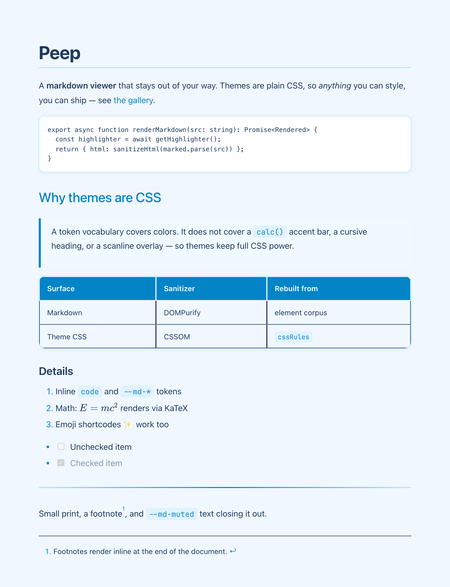</a> **Arctic Ice** | <a href="./art-deco.css">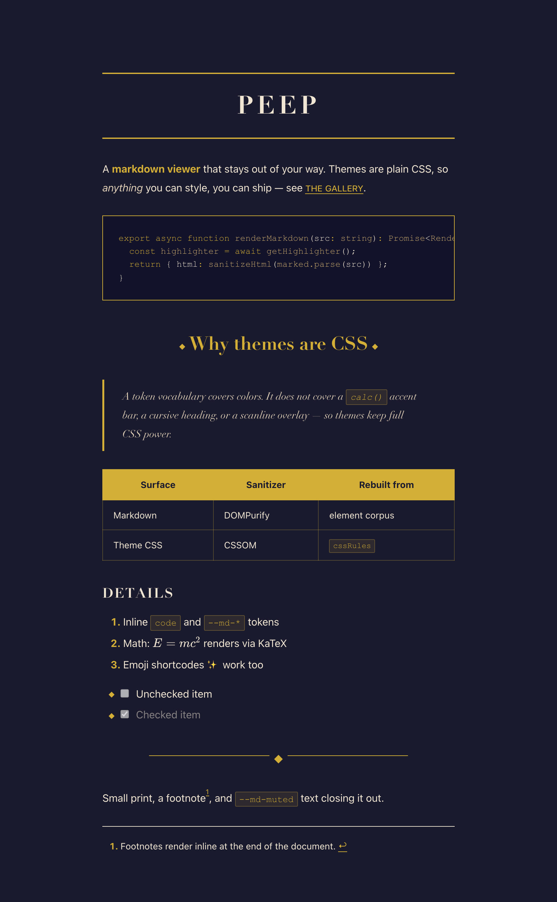</a> **Art Deco** | <a href="./cosmic-purple.css">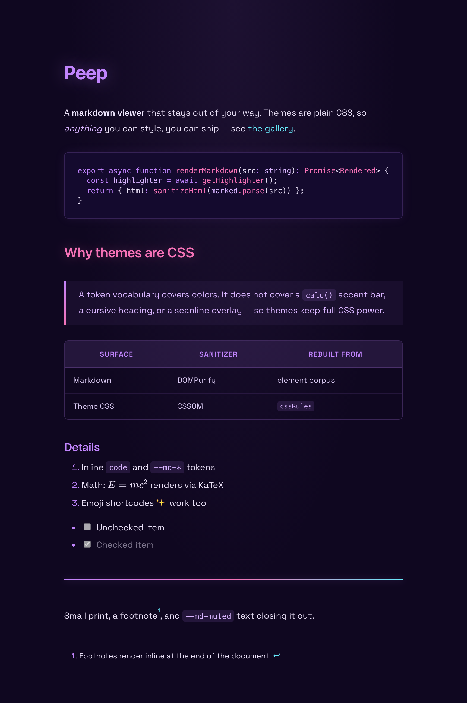</a> **Cosmic Purple** |
| <a href="./electric-blue.css">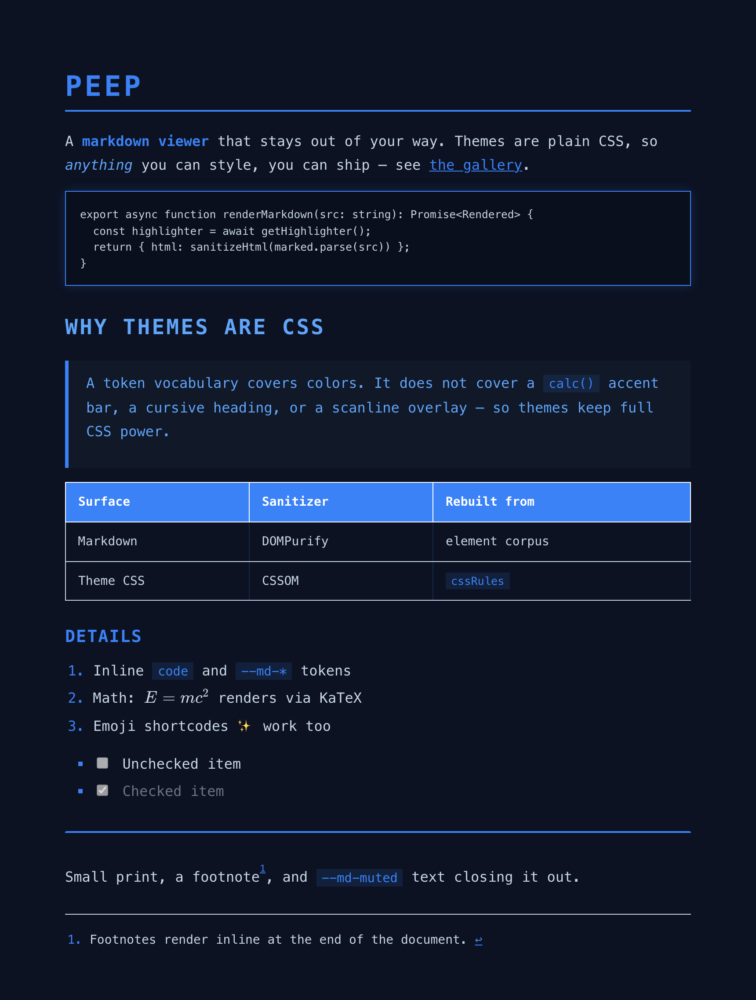</a> **Electric Blue** | <a href="./forest-earth.css">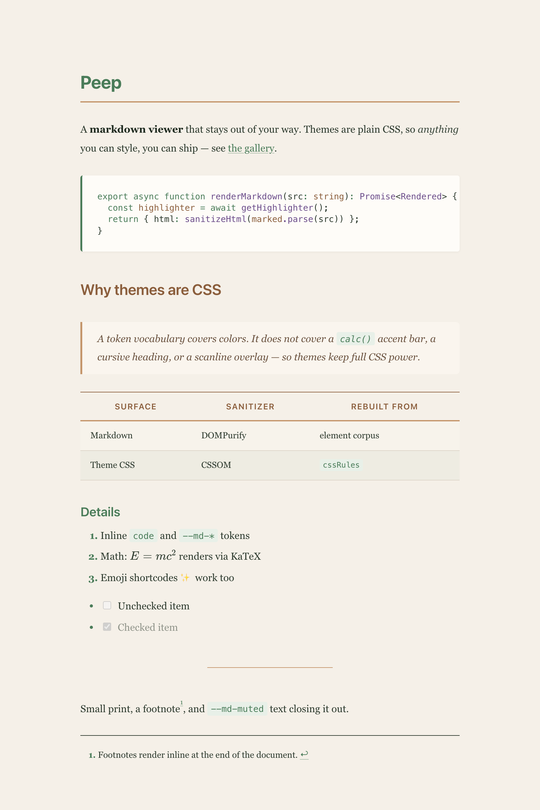</a> **Forest & Earth** | <a href="./glassmorphism.css">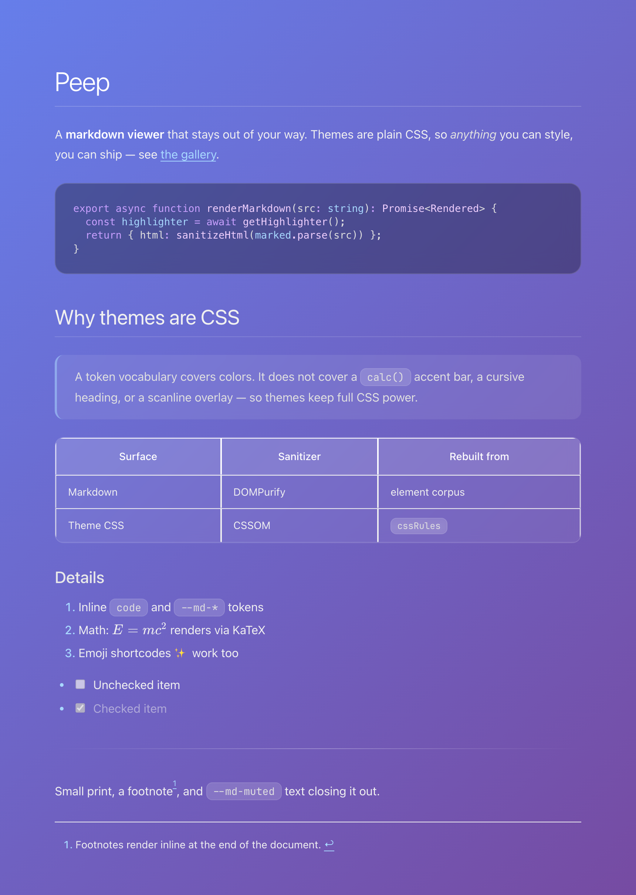</a> **Glassmorphism** |
| <a href="./handwritten.css">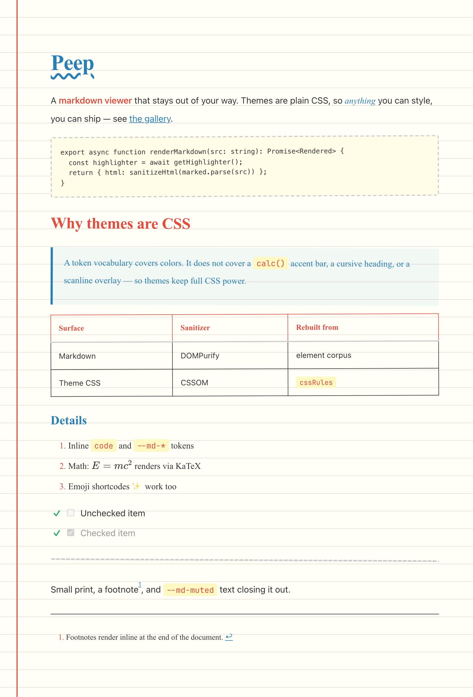</a> **Handwritten** | <a href="./ink-brush.css">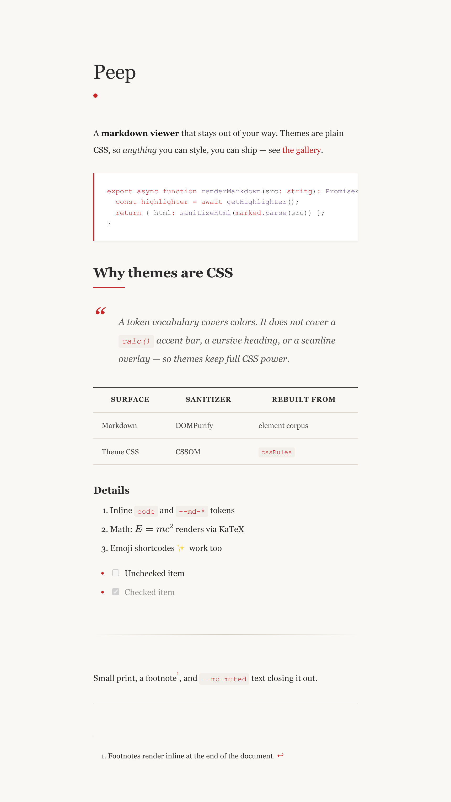</a> **Ink & Brush** | <a href="./neon-cyberpunk.css">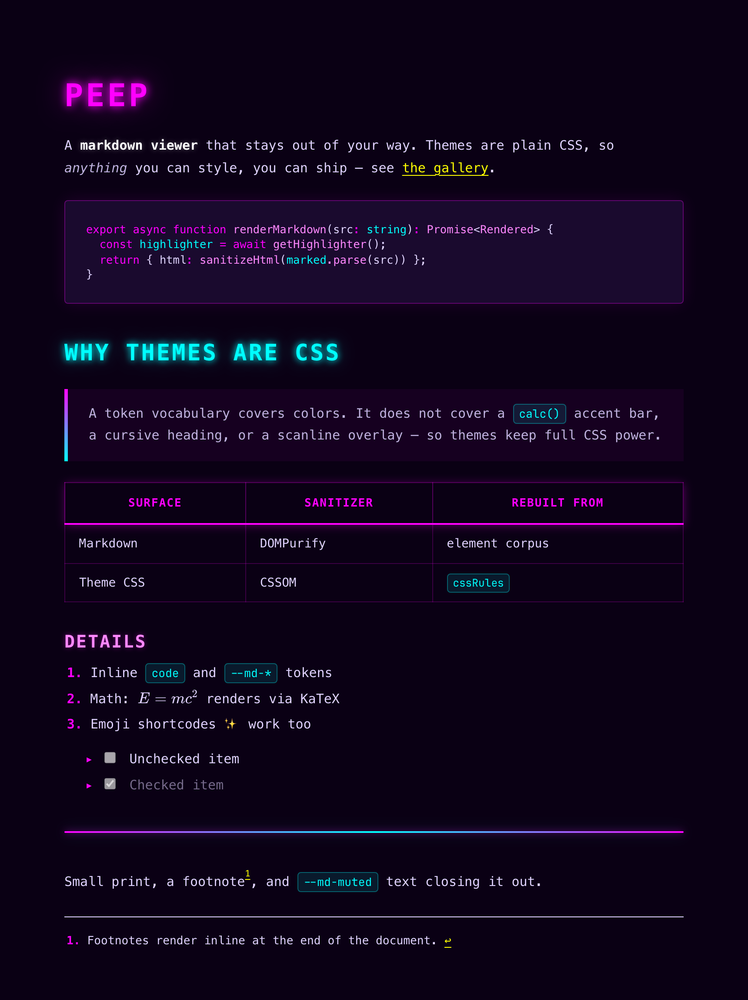</a> **Neon Cyberpunk** |
| <a href="./newspaper.css">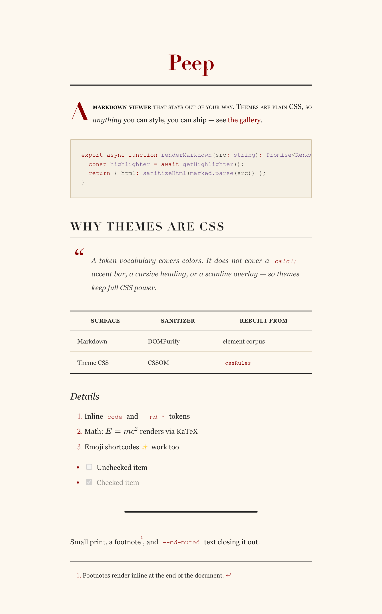</a> **Newspaper** | <a href="./retro-terminal.css">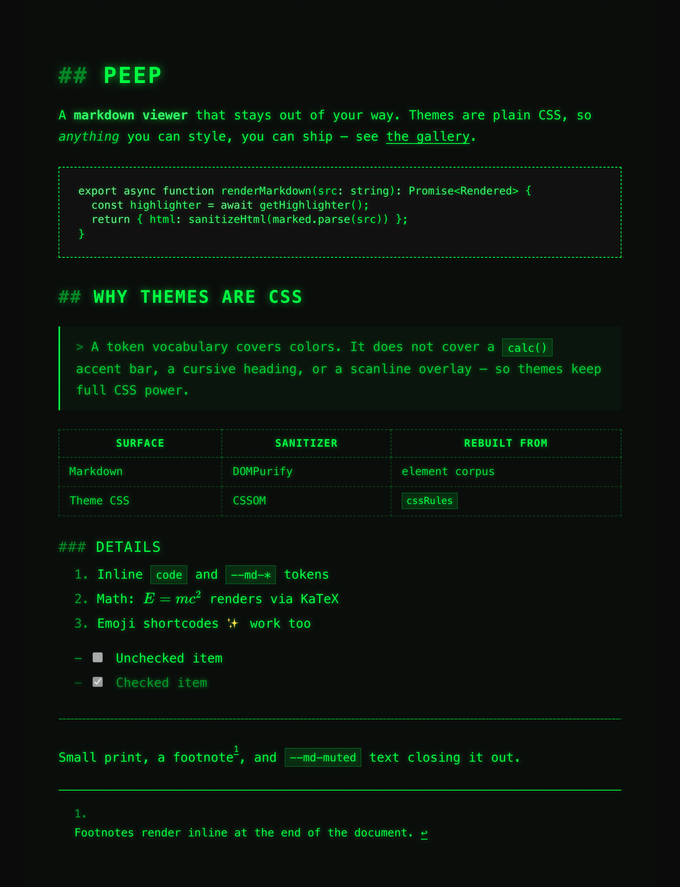</a> **Retro Terminal** | <a href="./sunset-desert.css">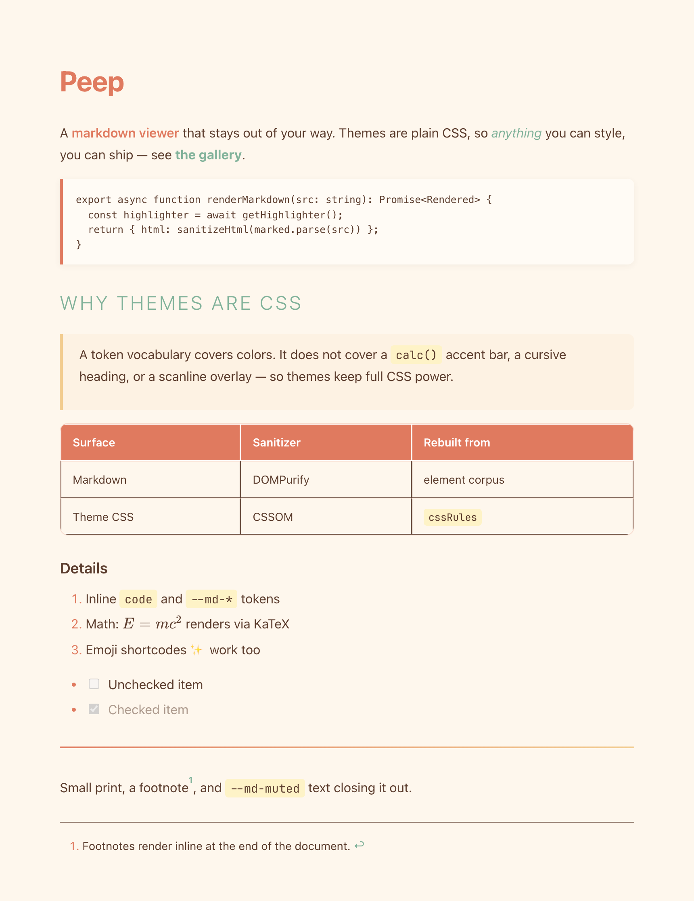</a> **Sunset Desert** |
| <a href="./tropical-sunset.css">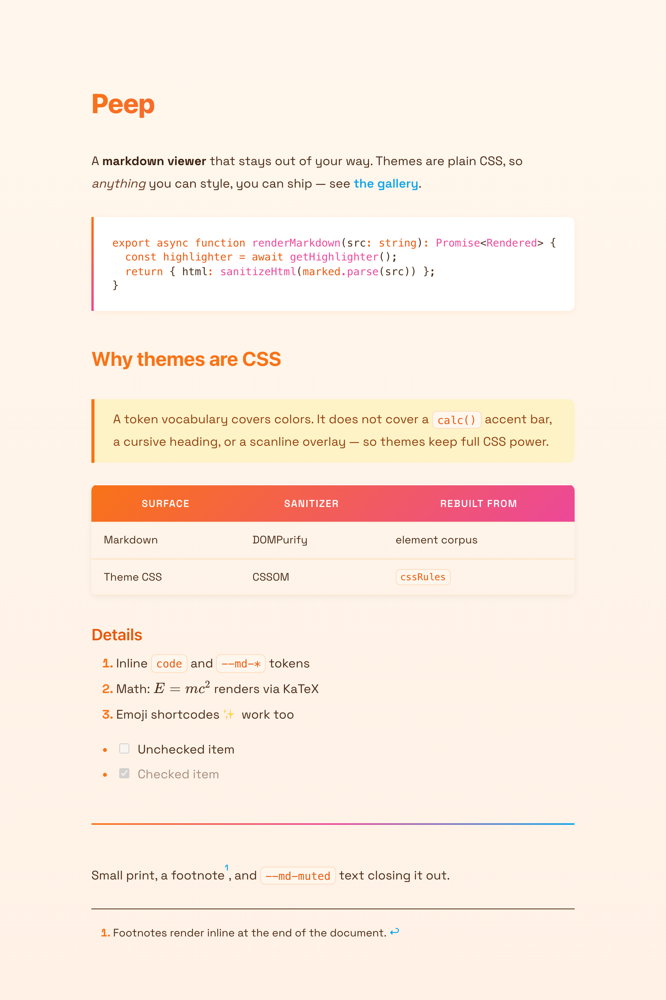</a> **Tropical Sunset** | <a href="./vaporwave.css">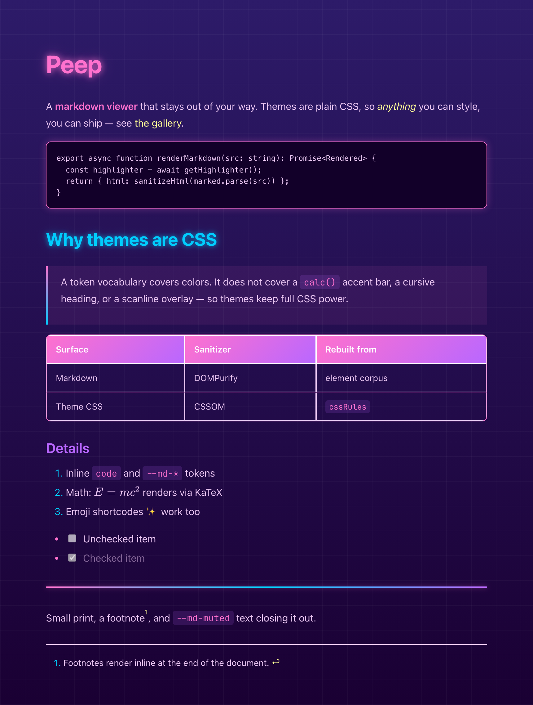</a> **Vaporwave** | <a href="./warm-paper.css">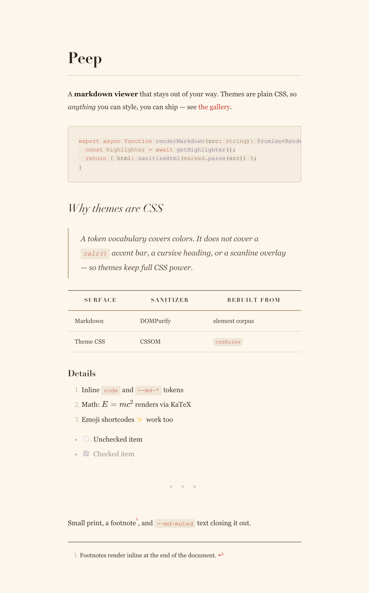</a> **Warm Paper** |

---

GENERATED by `scripts/generate-gallery-readme.ts` — do not edit by hand.
Regenerate with `pnpm gen:gallery-readme` after adding, removing, or editing a gallery theme.
